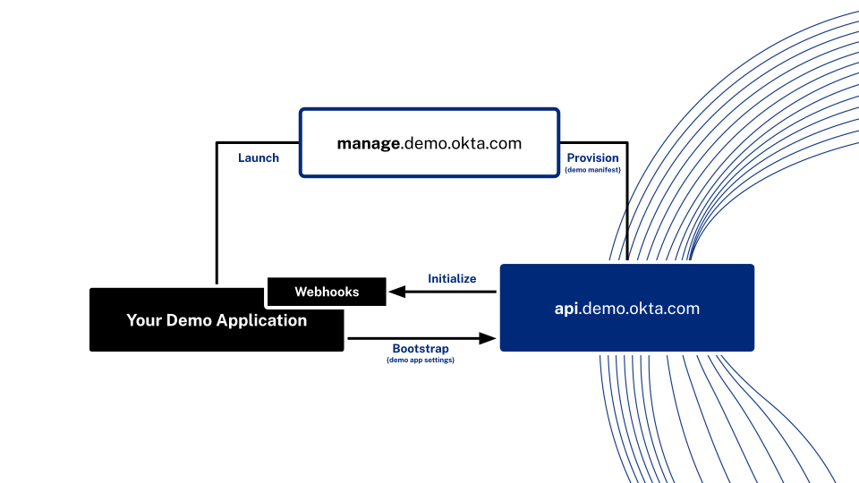

# Okta Demo Platform Quick Start Node

A quickstart application for token demonstration using the Okta Demo API in Node.js with Express.

This application supports both Okta identity provider products and can be dynamically configured using the Demo API to allow you to reuse your custom applications without the need for manual setup. 

# Experience the quickstart

This quickstart is deployed within the Demo Builder as a managed application. To use the managed deployment, include the "Node Quickstart" application into your demo from the management interface. You will then be able to launch [https://-your-demo-name-.nodequickstart.oktademo.engineering/](https://-your-demo-name-.nodequickstart.oktademo.engineering/).

The hosted quickstart exposes a single setting, you will see the value of this displayed when visiting the above link if you update the setting the new value will be reflected in the quickstart after 60 seconds.

# Running the quickstart for yourself

This quickstart is intended to allow you to quickly customize a demo application for a customer and include it as part of your demo from the demo builder. This can place your custom applications into the demo builder alongside all of the existing managed demo apps you are using today.

## Running locally

Running the quickstart locally is the fastest way to get started with a custom application in the Demo API. Within the repository, duplicate the .env.sample and rename it to .env. 

### Setup

**Demo Builder:** Register a new application within Demo Builder with the baseAddress http://localhost:3000 and multitenancy as "subdomain". Collect the OIDC settings and the application id and fill in the following block in the .env file.

DEMO_API_CLIENT_ID=
DEMO_API_CLIENT_SECRET=
DEMO_API_APP_ID=

From the Demo view add your localhost application.

**Direct API:**

### Launch 
Once the applciation is marked as 'active' you can navigate to [http://-your-demo-name-.localhost:3000](http://-your-demo-name-.localhost:3000) and the quickstart will automatically configure itself for your demo.

## Running Publically

To take advantage of the webhook behaviours in this quickstart you will need to host your code somewhere that the Demo API can reach.

### Hosting publically

Given the requirement for multiple levels of subdomaining this approach is not compatible with many of the on-demand hosting providers such as Glitch natively. Our recommendation is to host within AWS Elastic Beanstalk. From within AWS Route 53 you can point a custom domain (mydemo.example.com) to the Elastic Beanstalk instance with an A record, you can then also point the wildcard of the same address (*.mydemo.example.com) to the same instance.

Cloudflare only support a first level subdomain on their free tier (*.example.com) any attempt to do multiple subdomains will result in a cypher mismatch error. To support multiple levels you must purchase their Advanced Certificate Manager Add-On ($10 month).

If you have a deployment guide for other providers please reach out to #demo-eng-community.

# Concepts

## Multi-Tenancy

The power the Demo API is its ability to reuse demo applications with different IDPs and environments by dynamically delivering OIDC condif and settings dynamically. This is done through the /bootstrap endpoint of the API. This endpoint is called with the application id (returned when the application is registered to the Demo API) and the demo name that config is requested for.

This example acheives multi-tenancy with the implementation found in '''tenantResolver.js'''. Using the subdomain of the requesting host this implemenetation requests the configuration for this application id within that demo enviornment. If an instance of the application is found the returned OIDC settings are used to register Passport.js strategies for that subdomain.

When registering a multi-tenant application with the Demo API you must include "multiTenancy": "subdomain" in POST /applications or through the management UI. This cannot be changed once an application is registered.

## Demo Lifecycle Events

This example has implementations for the four demo lifecycle events (Request, Create, Update, Delete). These are used to manage your application within the dmeonstration IDP.

These are registered to the Demo API by providing the hooks object to the /applications endpoint either at registration or by subsequent update. The hooks object and each of the entries it contains are optional. Each of the provided values must be a valid https URI. When each hook is called it must respond with a 200 response within three seconds else the instance will be marked as 'error'.

The payload for each of these hooks can be found in the [API docs](https://docs.demo.okta.com).

### Request

The requested hooks can be used to prevent the creation of a application instance for example if your application does not support a given IDP or has a licensing requirement.

### Create

The created hook indicates that a demo has been created and an OIDC client has been registered to the demo IDP for this application. The payload for this hook includes a management credential for the demo IDP to allow your application to perform any additional setup that is required for example creating rules.

### Update

The update hook is fired when a user changes the provided settings for the application instance.

### Delete

The delete hook is fired when the removes the application from their demonstration. Your application should use the provided management credentials to remove any created objects. The OIDC client itself will be removed by the Demo API.

